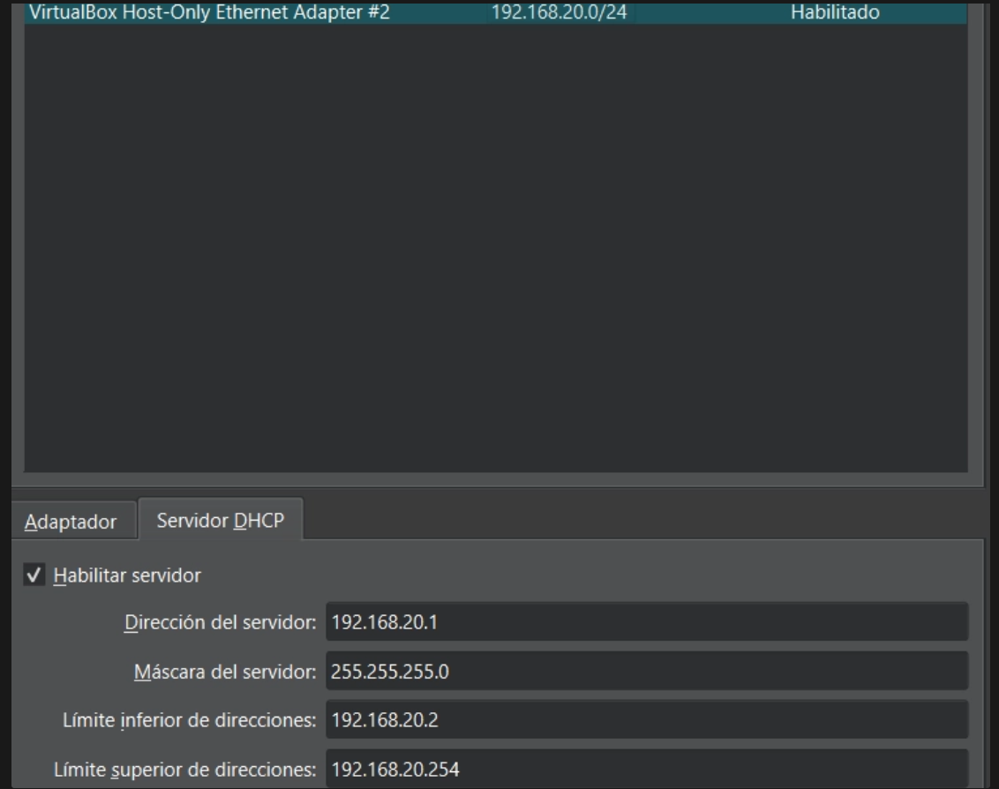
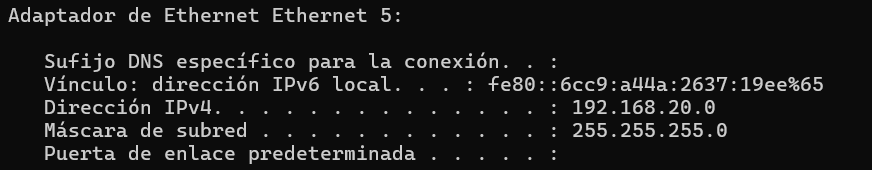

La función de este proyecto es monitorear trafico de red entre maquinas con un IDS ( en este caso Snort ) y practicar con ello técnicas de evasión usando Nmap.

Lo primero es configurar la red en la que vamos a trabajar:



Confirmo con ipconfig desde una powershell:

```powershell
ipconfig
```


Así el sistema host actúa como router virtual. Instalo snort aqui para monitorear todo el trafico entre las maquinas.

Así el sistema host actúa como router virtual.

Para ejecutar Snort abro una PowerShell.

Dentro me voy a la carpeta de Snort:

```powershell
cd C:\Snort\bin>
```

Y ejecuto el siguiente comando para identificar mi id de red:

```powershell
C:\Snort\bin> .\snort.exe -W
```

En este caso la mía es:


